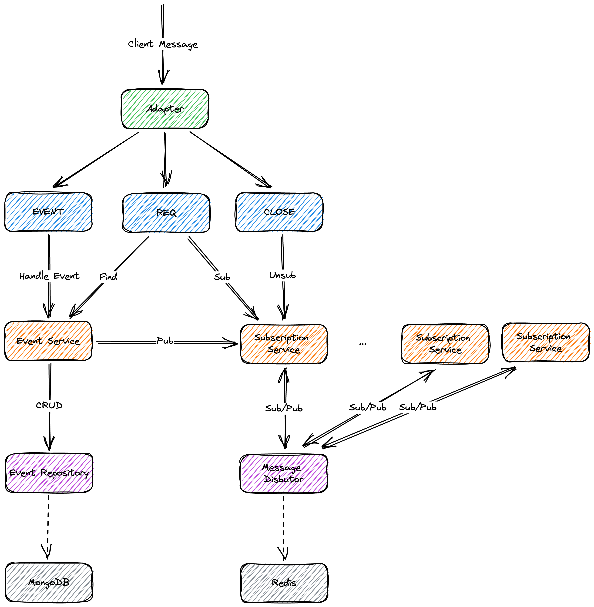

# Nostr Relay NestJS

## Support NIPs

✅ NIP-01: Basic protocol flow description
✅ NIP-02: Contact List and Petnames
✅ NIP-09: Event Deletion
✅ NIP-11: Relay Information Document
✅ NIP-12: Generic Tag Queries
🚧 NIP-13: Proof of Work
✅ NIP-15: End of Stored Events Notice
✅ NIP-16: Event Treatment
✅ NIP-20: Command Results
🚧 NIP-22: Event created_at Limits
🚧 NIP-26: Delegated Event Signing
✅ NIP-28: Public Chat
🚧 NIP-33: Parameterized Replaceable Events
🚧 NIP-40: Expiration Timestamp

## ToDo

- [ ] test
- [ ] quick start
- [ ] support multi nodes

## Structure

